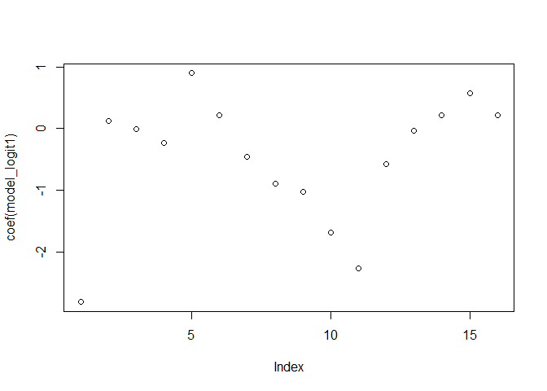
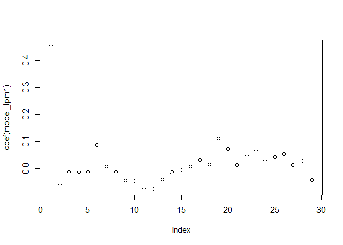
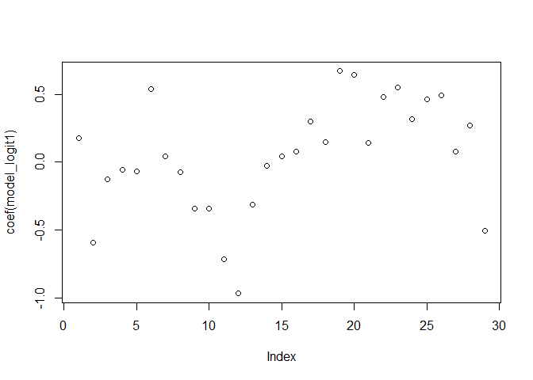
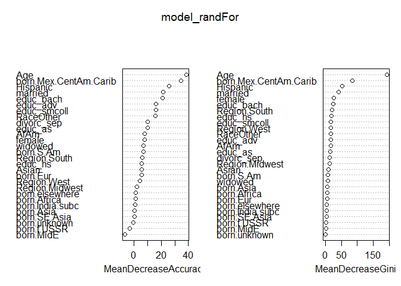
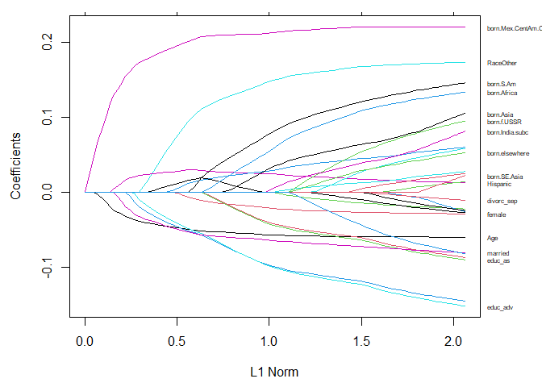
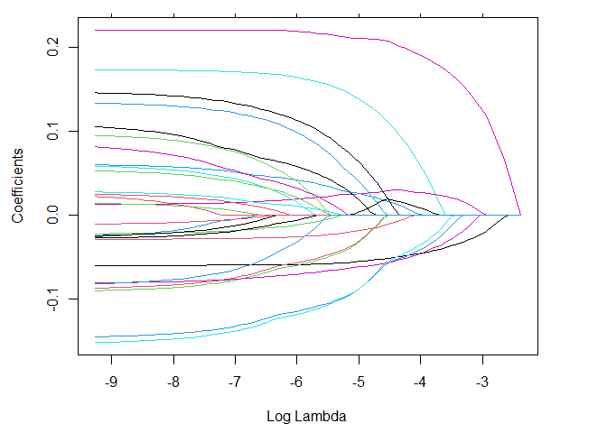
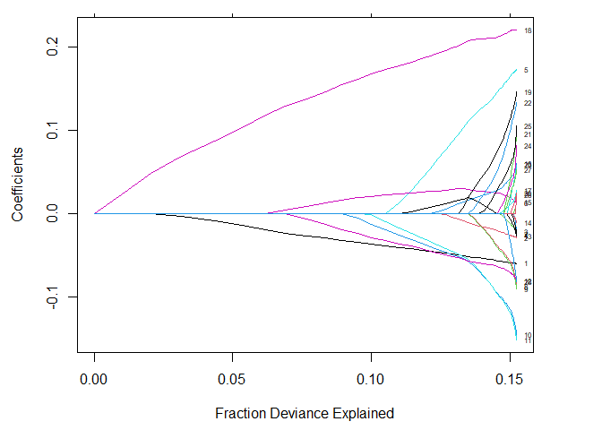

## Understanding different methods to classify data
by Tamires Amorim

The following project wants to understand what factors make an adult
more likely to have health insurance. The analysis of the interactions
between the binary variable (not covered by insurance NOTCOV) as the
dependent variable with different explanatory will be based in the
models logit, random forest, support vector machines and elastic net
methods.

### 1\. Subset the data:

We decided to focus our subgroup on people who work full time, who’s
ages range from 21 to 75 and who make a yearly wage earning of 10,000 to
75,000.

``` r
data_use1$earn_lastyr <- as.factor(data_use1$ERNYR_P)
levels(data_use1$earn_lastyr) <- c("0","$01-$4999","$5000-$9999","$10000-$14999","$15000-$19999","$20000-$24999","$25000-$34999","$35000-$44999","$45000-$54999","$55000-$64999","$65000-$74999","$75000 and over", "refused", "IS NA")
dat2 <- subset(data_use1, ((AGE_P >= 21) & (AGE_P <= 75)))
```

### 2\. Run the logit model, glm (linear regression with a dependent binary variable):

Here we are looking into the insurance coverage as dependent variable,
and age, gender, race, education, marital status and region as the
explanatory variables for why people are not with insurance coverage.

``` r
model_logit1 <- glm(NOTCOV ~ AGE_P + I(AGE_P^2) + female + Hispanic + Asian +  educ_hs + educ_smcoll + educ_as + educ_bach + educ_adv + married + divorc_sep + REGION, family = binomial, data = dat2)
summary(model_logit1)
```

    ## 
    ## Call:
    ## glm(formula = NOTCOV ~ AGE_P + I(AGE_P^2) + female + Hispanic + 
    ##     Asian + educ_hs + educ_smcoll + educ_as + educ_bach + educ_adv + 
    ##     married + divorc_sep + REGION, family = binomial, data = dat2)
    ## 
    ## Deviance Residuals: 
    ##     Min       1Q   Median       3Q      Max  
    ## -1.6401  -0.5943  -0.3776  -0.2001   3.2871  
    ## 
    ## Coefficients:
    ##                 Estimate Std. Error z value Pr(>|z|)    
    ## (Intercept)   -2.807e+00  1.253e-01 -22.411  < 2e-16 ***
    ## AGE_P          1.273e-01  5.935e-03  21.449  < 2e-16 ***
    ## I(AGE_P^2)    -1.853e-03  6.788e-05 -27.297  < 2e-16 ***
    ## female        -2.339e-01  2.222e-02 -10.525  < 2e-16 ***
    ## Hispanic       8.968e-01  2.553e-02  35.122  < 2e-16 ***
    ## Asian          2.233e-01  4.684e-02   4.768 1.86e-06 ***
    ## educ_hs       -4.514e-01  2.988e-02 -15.107  < 2e-16 ***
    ## educ_smcoll   -8.963e-01  3.498e-02 -25.619  < 2e-16 ***
    ## educ_as       -1.028e+00  4.216e-02 -24.375  < 2e-16 ***
    ## educ_bach     -1.676e+00  4.314e-02 -38.865  < 2e-16 ***
    ## educ_adv      -2.266e+00  7.042e-02 -32.185  < 2e-16 ***
    ## married       -5.717e-01  2.587e-02 -22.095  < 2e-16 ***
    ## divorc_sep    -3.214e-02  3.769e-02  -0.853    0.394    
    ## REGIONMidwest  2.168e-01  4.122e-02   5.260 1.44e-07 ***
    ## REGIONSouth    5.789e-01  3.555e-02  16.282  < 2e-16 ***
    ## REGIONWest     2.118e-01  3.732e-02   5.674 1.40e-08 ***
    ## ---
    ## Signif. codes:  0 '***' 0.001 '**' 0.01 '*' 0.05 '.' 0.1 ' ' 1
    ## 
    ## (Dispersion parameter for binomial family taken to be 1)
    ## 
    ##     Null deviance: 63569  on 73879  degrees of freedom
    ## Residual deviance: 53049  on 73864  degrees of freedom
    ## AIC: 53081
    ## 
    ## Number of Fisher Scoring iterations: 6

``` r
require(lmtest)
```

    ## Loading required package: lmtest

    ## Loading required package: zoo

    ## 
    ## Attaching package: 'zoo'

    ## The following objects are masked from 'package:base':
    ## 
    ##     as.Date, as.Date.numeric

``` r
coeftest(model_logit1)
```

    ## 
    ## z test of coefficients:
    ## 
    ##                  Estimate  Std. Error  z value  Pr(>|z|)    
    ## (Intercept)   -2.8070e+00  1.2526e-01 -22.4106 < 2.2e-16 ***
    ## AGE_P          1.2729e-01  5.9346e-03  21.4491 < 2.2e-16 ***
    ## I(AGE_P^2)    -1.8529e-03  6.7879e-05 -27.2967 < 2.2e-16 ***
    ## female        -2.3389e-01  2.2223e-02 -10.5247 < 2.2e-16 ***
    ## Hispanic       8.9676e-01  2.5533e-02  35.1217 < 2.2e-16 ***
    ## Asian          2.2331e-01  4.6839e-02   4.7676 1.865e-06 ***
    ## educ_hs       -4.5144e-01  2.9883e-02 -15.1072 < 2.2e-16 ***
    ## educ_smcoll   -8.9626e-01  3.4984e-02 -25.6190 < 2.2e-16 ***
    ## educ_as       -1.0277e+00  4.2163e-02 -24.3749 < 2.2e-16 ***
    ## educ_bach     -1.6765e+00  4.3136e-02 -38.8649 < 2.2e-16 ***
    ## educ_adv      -2.2664e+00  7.0419e-02 -32.1846 < 2.2e-16 ***
    ## married       -5.7168e-01  2.5874e-02 -22.0950 < 2.2e-16 ***
    ## divorc_sep    -3.2145e-02  3.7695e-02  -0.8528    0.3938    
    ## REGIONMidwest  2.1683e-01  4.1222e-02   5.2601 1.440e-07 ***
    ## REGIONSouth    5.7888e-01  3.5553e-02  16.2823 < 2.2e-16 ***
    ## REGIONWest     2.1178e-01  3.7325e-02   5.6739 1.396e-08 ***
    ## ---
    ## Signif. codes:  0 '***' 0.001 '**' 0.01 '*' 0.05 '.' 0.1 ' ' 1

``` r
exp(model_logit1$coefficients)
```

    ##   (Intercept)         AGE_P    I(AGE_P^2)        female      Hispanic 
    ##    0.06038342    1.13574922    0.99814885    0.79144828    2.45163612 
    ##         Asian       educ_hs   educ_smcoll       educ_as     educ_bach 
    ##    1.25020550    0.63671027    0.40809134    0.35782125    0.18702824 
    ##      educ_adv       married    divorc_sep REGIONMidwest   REGIONSouth 
    ##    0.10368536    0.56457629    0.96836645    1.24213288    1.78403426 
    ##    REGIONWest 
    ##    1.23587261

``` r
plot(coef(model_logit1))
```

<!-- -->

### Results:

14 out of the 15 variables have a p-value lower than alpha (0.05);
therefore the variables are significant, except the variable
“divorc\_sep” that do not contain enough information to reject the
null hypothesis. Reflecting on the NOTCOV as a dummy with 1 “as yes” and
0 “as no”, we assume that coefficients with a negative sign have
insurance coverage and the ones with a positive sign do not have it.

### 3.Setting the explanatory variables for the Random Forest, Support Vector Machines and Elastic net methods:

For the simple linear regression (glm function) it is not necessary to
set the variables in a data frame. Although for the new models we are
using it will be necessary. Below is the data frame with the list of
variables set to have the same number of rows with unique row names in
the class “data.frame”. Because it includes a matrix it will force the
columns names to have unique results.

``` r
d_region <- data.frame(model.matrix(~ dat2$REGION))
d_region_born <- data.frame(model.matrix(~ factor(dat2$region_born)))  # snips any with zero in the subgroup
dat_for_analysis_sub <- data.frame(
  dat2$NOTCOV,
  dat2$AGE_P,
  dat2$female,
  dat2$AfAm,
  dat2$Asian,
  dat2$RaceOther,
  dat2$Hispanic,
  dat2$educ_hs,
  dat2$educ_smcoll,
  dat2$educ_as,
  dat2$educ_bach,
  dat2$educ_adv,
  dat2$married,
  dat2$widowed,
  dat2$divorc_sep,
  d_region[,2:4],
  d_region_born[,2:12]) # need [] since model.matrix includes intercept term

names(dat_for_analysis_sub) <- c("NOTCOV",
                                 "Age",
                                 "female",
                                 "AfAm",
                                 "Asian",
                                 "RaceOther",
                                 "Hispanic",
                                 "educ_hs",
                                 "educ_smcoll",
                                 "educ_as",
                                 "educ_bach",
                                 "educ_adv",
                                 "married",
                                 "widowed",
                                 "divorc_sep",
                                 "Region.Midwest",
                                 "Region.South",
                                 "Region.West",
                                 "born.Mex.CentAm.Carib",
                                 "born.S.Am",
                                 "born.Eur",
                                 "born.f.USSR",
                                 "born.Africa",
                                 "born.MidE",
                                 "born.India.subc",
                                 "born.Asia",
                                 "born.SE.Asia",
                                 "born.elsewhere",
                                 "born.unknown")
```

### 4.Create a common data object that is standardized:

The goal here is to keep the regression parameters in a similar scale,
and ensure that the intercept represents the corrected mean, this way
the output of the regression will be easier to interpret.Following, we
split into training and test sets.

From the summary(restrict\_1) is observed 7348 people in the training
set against 66532 in the test set.

``` r
summary(restrict_1)
```

    ##    Mode   FALSE    TRUE 
    ## logical   66532    7348

From the summary(sobj$data), it is possible to see the age with a mean
zero, for the other variables how many are inside the true or false
groups, for NOTCOV there is a mean of 0.1526 and max of 1.0000.

``` r
summary(sobj$data)
```

    ##      NOTCOV              Age.V1        female   AfAm     Asian    RaceOther
    ##  Min.   :0.0000   Min.   :-1.6896475   1:3774   1:1030   1: 519   1: 131   
    ##  1st Qu.:0.0000   1st Qu.:-0.8779981   0:3574   0:6318   0:6829   0:7217   
    ##  Median :0.0000   Median : 0.0012887                                       
    ##  Mean   :0.1526   Mean   : 0.0000000                                       
    ##  3rd Qu.:0.0000   3rd Qu.: 0.8129380                                       
    ##  Max.   :1.0000   Max.   : 1.9627746                                       
    ##  Hispanic educ_hs  educ_smcoll educ_as  educ_bach educ_adv married  widowed 
    ##  1:1464   1:1949   1:1315      1: 895   1:1324    1: 735   1:4224   1: 242  
    ##  0:5884   0:5399   0:6033      0:6453   0:6024    0:6613   0:3124   0:7106  
    ##                                                                             
    ##                                                                             
    ##                                                                             
    ##                                                                             
    ##  divorc_sep Region.Midwest Region.South Region.West born.Mex.CentAm.Carib
    ##  1: 878     1:1441         1:2568       1:2140      1: 879               
    ##  0:6470     0:5907         0:4780       0:5208      0:6469               
    ##                                                                          
    ##                                                                          
    ##                                                                          
    ##                                                                          
    ##  born.S.Am born.Eur born.f.USSR born.Africa born.MidE born.India.subc born.Asia
    ##  1:  82    1:  91   1:  18      1:  64      1:  32    1:  89          1: 105   
    ##  0:7266    0:7257   0:7330      0:7284      0:7316    0:7259          0:7243   
    ##                                                                                
    ##                                                                                
    ##                                                                                
    ##                                                                                
    ##  born.SE.Asia born.elsewhere born.unknown
    ##  1: 191       1:  48         1:  18      
    ##  0:7157       0:7300         0:7330      
    ##                                          
    ##                                          
    ##                                          
    ## 

### 5\. Different models after normalizing the variables

#### a)Linear regression:

The goal with this model is to understand how to call the standardized
objects from above and interpret the results with the “traditional
model” of linear regression. The lm function.

``` r
table(pred = pred_model_lpm1, true = dat_test$NOTCOV)
```

    ##        true
    ## pred        0     1
    ##   FALSE 55806  9476
    ##   TRUE    442   808

``` r
coeftest(model_lpm1)
```

    ## 
    ## t test of coefficients:
    ## 
    ##                          Estimate Std. Error  t value  Pr(>|t|)    
    ## (Intercept)             0.4530494  0.0939450   4.8225 1.446e-06 ***
    ## Age                    -0.0599723  0.0044379 -13.5135 < 2.2e-16 ***
    ## female1                -0.0145832  0.0039275  -3.7131 0.0002062 ***
    ## AfAm1                  -0.0114373  0.0060139  -1.9018 0.0572361 .  
    ## Asian1                 -0.0146732  0.0134932  -1.0875 0.2768725    
    ## RaceOther1              0.0865860  0.0148129   5.8453 5.274e-09 ***
    ## Hispanic1               0.0061282  0.0071540   0.8566 0.3916816    
    ## educ_hs1               -0.0131397  0.0065325  -2.0114 0.0443154 *  
    ## educ_smcoll1           -0.0443787  0.0071484  -6.2082 5.653e-10 ***
    ## educ_as1               -0.0459546  0.0078030  -5.8894 4.048e-09 ***
    ## educ_bach1             -0.0734556  0.0072150 -10.1809 < 2.2e-16 ***
    ## educ_adv1              -0.0768930  0.0083741  -9.1822 < 2.2e-16 ***
    ## married1               -0.0406368  0.0049827  -8.1556 4.057e-16 ***
    ## widowed1               -0.0142738  0.0120969  -1.1800 0.2380566    
    ## divorc_sep1            -0.0057201  0.0071443  -0.8006 0.4233621    
    ## Region.Midwest1         0.0074723  0.0065554   1.1399 0.2543823    
    ## Region.South1           0.0303993  0.0058824   5.1678 2.431e-07 ***
    ## Region.West1            0.0142005  0.0061674   2.3025 0.0213346 *  
    ## born.Mex.CentAm.Carib1  0.1098199  0.0085136  12.8994 < 2.2e-16 ***
    ## born.S.Am1              0.0734948  0.0193568   3.7968 0.0001477 ***
    ## born.Eur1               0.0128763  0.0175726   0.7327 0.4637357    
    ## born.f.USSR1            0.0485435  0.0392920   1.2355 0.2167008    
    ## born.Africa1            0.0673095  0.0212905   3.1615 0.0015761 ** 
    ## born.MidE1              0.0299831  0.0295104   1.0160 0.3096542    
    ## born.India.subc1        0.0425306  0.0219669   1.9361 0.0528913 .  
    ## born.Asia1              0.0545313  0.0204818   2.6624 0.0077750 ** 
    ## born.SE.Asia1           0.0128209  0.0177300   0.7231 0.4696315    
    ## born.elsewhere1         0.0270967  0.0242187   1.1188 0.2632482    
    ## born.unknown1          -0.0420580  0.0393322  -1.0693 0.2849697    
    ## ---
    ## Signif. codes:  0 '***' 0.001 '**' 0.01 '*' 0.05 '.' 0.1 ' ' 1

``` r
exp(model_lpm1$coefficients)
```

    ##            (Intercept)                    Age                female1 
    ##              1.5731018              0.9417906              0.9855227 
    ##                  AfAm1                 Asian1             RaceOther1 
    ##              0.9886278              0.9854339              1.0904451 
    ##              Hispanic1               educ_hs1           educ_smcoll1 
    ##              1.0061471              0.9869462              0.9565916 
    ##               educ_as1             educ_bach1              educ_adv1 
    ##              0.9550853              0.9291774              0.9259889 
    ##               married1               widowed1            divorc_sep1 
    ##              0.9601778              0.9858276              0.9942963 
    ##        Region.Midwest1          Region.South1           Region.West1 
    ##              1.0075003              1.0308661              1.0143018 
    ## born.Mex.CentAm.Carib1             born.S.Am1              born.Eur1 
    ##              1.1160771              1.0762629              1.0129595 
    ##           born.f.USSR1           born.Africa1             born.MidE1 
    ##              1.0497410              1.0696265              1.0304371 
    ##       born.India.subc1             born.Asia1          born.SE.Asia1 
    ##              1.0434480              1.0560455              1.0129034 
    ##        born.elsewhere1          born.unknown1 
    ##              1.0274672              0.9588142

``` r
plot(coef(model_lpm1))
```

<!-- -->

### Results:

The LM model classified a total of 66532 predictions, out of those 1250
were predicted as the ones that do not have health insurance, and 65282
as the ones who have it. In reality, the sample have 56248 with health
insurance and 10284 without health insurance.

Accuracy: To find the accuracy we take the true positive (808) + true
negative (55806) and divide by the total (66532) which gives us 0.85 or
85% of the times the classifier is correct.

Mis-classification rate: to find how often the model is wrong, we take
the false positive (442) + false negative (9476) and divide by the total
(66532) which give us 0.149 or 15% is our “error rate”.

False Positives Rate: When it is actually “no coverage”, how often does
it predict “yes coverage”. Here we calculate False positive (442)
divided by the actual not covered (56248) which is 0.007858057 or 0.7%

False Negatives: When it is actually “no coverage”, how often does it
predict “yes covered”. Here we calculate False negative (9476) divided
by the false negative (9476) plus the true positive (808) which is 0.921
or 92%

#### b) Logit model:

The goal with this model is to understand the differences between the
linear model above and the logit model when we call standardized
objects.

``` r
table(pred = pred_model_logit1, true = dat_test$NOTCOV)
```

    ##        true
    ## pred        0     1
    ##   FALSE 55118  8638
    ##   TRUE   1130  1646

``` r
coeftest(model_logit1)
```

    ## 
    ## z test of coefficients:
    ## 
    ##                         Estimate Std. Error  z value  Pr(>|z|)    
    ## (Intercept)             0.175852   0.938542   0.1874 0.8513730    
    ## Age                    -0.590354   0.044802 -13.1770 < 2.2e-16 ***
    ## female1                -0.123582   0.036165  -3.4172 0.0006327 ***
    ## AfAm1                  -0.058707   0.055352  -1.0606 0.2888608    
    ## Asian1                 -0.066254   0.123195  -0.5378 0.5907162    
    ## RaceOther1              0.536324   0.106218   5.0493 4.435e-07 ***
    ## Hispanic1               0.041087   0.059471   0.6909 0.4896396    
    ## educ_hs1               -0.072205   0.050228  -1.4375 0.1505658    
    ## educ_smcoll1           -0.341954   0.058828  -5.8128 6.144e-09 ***
    ## educ_as1               -0.339443   0.067351  -5.0399 4.657e-07 ***
    ## educ_bach1             -0.713755   0.071641  -9.9629 < 2.2e-16 ***
    ## educ_adv1              -0.968537   0.114740  -8.4411 < 2.2e-16 ***
    ## married1               -0.311619   0.043446  -7.1725 7.364e-13 ***
    ## widowed1               -0.028780   0.125711  -0.2289 0.8189188    
    ## divorc_sep1             0.042825   0.061048   0.7015 0.4829909    
    ## Region.Midwest1         0.076357   0.066814   1.1428 0.2531071    
    ## Region.South1           0.297991   0.057419   5.1898 2.105e-07 ***
    ## Region.West1            0.146882   0.060155   2.4417 0.0146169 *  
    ## born.Mex.CentAm.Carib1  0.670571   0.064848  10.3407 < 2.2e-16 ***
    ## born.S.Am1              0.644237   0.145663   4.4228 9.744e-06 ***
    ## born.Eur1               0.141229   0.179323   0.7876 0.4309495    
    ## born.f.USSR1            0.482928   0.348757   1.3847 0.1661408    
    ## born.Africa1            0.551944   0.167728   3.2907 0.0009993 ***
    ## born.MidE1              0.317593   0.324476   0.9788 0.3276859    
    ## born.India.subc1        0.463620   0.199747   2.3210 0.0202847 *  
    ## born.Asia1              0.494481   0.174463   2.8343 0.0045926 ** 
    ## born.SE.Asia1           0.078271   0.174802   0.4478 0.6543197    
    ## born.elsewhere1         0.267715   0.214017   1.2509 0.2109677    
    ## born.unknown1          -0.506785   0.532939  -0.9509 0.3416420    
    ## ---
    ## Signif. codes:  0 '***' 0.001 '**' 0.01 '*' 0.05 '.' 0.1 ' ' 1

``` r
exp(model_logit1$coefficients)
```

    ##            (Intercept)                    Age                female1 
    ##              1.1922611              0.5541312              0.8837496 
    ##                  AfAm1                 Asian1             RaceOther1 
    ##              0.9429826              0.9358928              1.7097105 
    ##              Hispanic1               educ_hs1           educ_smcoll1 
    ##              1.0419432              0.9303405              0.7103812 
    ##               educ_as1             educ_bach1              educ_adv1 
    ##              0.7121672              0.4898013              0.3796381 
    ##               married1               widowed1            divorc_sep1 
    ##              0.7322605              0.9716303              1.0437552 
    ##        Region.Midwest1          Region.South1           Region.West1 
    ##              1.0793481              1.3471499              1.1582175 
    ## born.Mex.CentAm.Carib1             born.S.Am1              born.Eur1 
    ##              1.9553539              1.9045328              1.1516884 
    ##           born.f.USSR1           born.Africa1             born.MidE1 
    ##              1.6208131              1.7366258              1.3738166 
    ##       born.India.subc1             born.Asia1          born.SE.Asia1 
    ##              1.5898183              1.6396464              1.0814158 
    ##        born.elsewhere1          born.unknown1 
    ##              1.3069751              0.6024290

``` r
plot(coef(model_logit1))
```

<!-- -->

### Results:

The logit model classified a total of 66532 predictions, out of those
2776 were predicted as the ones that do not have health insurance, and
63756 as the ones who have it. In reality, the sample have 56248 with
health insurance and 10284 without health insurance.

Accuracy: To find the accuracy we take the true positive (1646) + true
negative (55118) and divide by the total (66532) which gives us 0.85 or
85% of the times the classifier is correct.

Mis-classification rate: to find how often the model is wrong, we take
the false positive (1130) + false negative (8638) and divide by the
total (66532) which give us 0.146 or 15% is our “error rate”.

False Positives Rate: When it is actually “no coverage”, how often does
it predict “yes coverage”. Here we calculate False positive (1130)
divided by the actual not covered (10284) which is 0.109 or 10.9%

False Negatives: When it is actually “no coverage”, how often does it
predict “yes covered”. Here we calculate False negative (8638) divided
by the false negative (8638) plus the true positive (1646) which is
0.839 or 84%

### Comparing LPM and Logit:

When comparing both models, the differences were on the numbers inside
the table for each class although when calculating there are small
differences between false positive and false negative. Apparently, the
model logit have a lower false negative rate, which implies it might be
a better way to classify the data than the LPM model. Another
interesting point is that the error rate for both models is the same,
leaving us with the only option to evaluate the trade off between false
negative and false positive when deciding which model will make our
classification better.

#### c) Random Forest model:

We will use the random forest to improve the classification accuracy.

``` r
knitr::opts_chunk$set(echo = TRUE)
require('randomForest')
```

    ## Loading required package: randomForest

    ## Warning: package 'randomForest' was built under R version 4.0.3

    ## randomForest 4.6-14

    ## Type rfNews() to see new features/changes/bug fixes.

``` r
set.seed(54321)
model_randFor <- randomForest(as.factor(NOTCOV) ~ ., data = sobj$data, importance=TRUE, proximity=TRUE)
print(model_randFor)
```

    ## 
    ## Call:
    ##  randomForest(formula = as.factor(NOTCOV) ~ ., data = sobj$data,      importance = TRUE, proximity = TRUE) 
    ##                Type of random forest: classification
    ##                      Number of trees: 500
    ## No. of variables tried at each split: 5
    ## 
    ##         OOB estimate of  error rate: 14.41%
    ## Confusion matrix:
    ##      0   1 class.error
    ## 0 6153  74  0.01188373
    ## 1  985 136  0.87867975

``` r
round(importance(model_randFor),2)
```

    ##                           0     1 MeanDecreaseAccuracy MeanDecreaseGini
    ## Age                   23.26 31.79                38.66           193.29
    ## female                 3.29  8.76                 7.63            25.76
    ## AfAm                   5.81  3.30                 7.66            16.50
    ## Asian                  5.47  0.09                 5.57             9.42
    ## RaceOther              9.51 14.44                15.50            16.80
    ## Hispanic               2.63 16.13                25.89            51.88
    ## educ_hs               10.05 -7.99                 5.64            18.49
    ## educ_smcoll           13.97  4.78                16.03            17.95
    ## educ_as                7.63  5.17                 9.92            14.76
    ## educ_bach             12.91 18.30                20.88            24.49
    ## educ_adv               8.51 17.67                16.13            16.62
    ## married               18.48  6.45                21.18            40.70
    ## widowed                6.93 -0.97                 7.07             7.49
    ## divorc_sep            11.78 -4.55                10.00            13.28
    ## Region.Midwest         0.28  2.76                 1.95            13.11
    ## Region.South           4.27  3.57                 6.06            20.83
    ## Region.West            4.53 -1.07                 4.29            17.00
    ## born.Mex.CentAm.Carib  6.37 39.48                34.80            84.07
    ## born.S.Am              5.08  4.56                 6.87             7.83
    ## born.Eur               2.11  7.79                 5.57             5.41
    ## born.f.USSR           -5.03  3.80                -3.29             2.54
    ## born.Africa           -3.01  8.14                 0.98             6.26
    ## born.MidE             -6.99  0.42                -6.89             2.01
    ## born.India.subc        1.56 -2.49                 0.63             4.86
    ## born.Asia             -0.74  1.95                 0.16             6.66
    ## born.SE.Asia           1.71 -4.91                 0.03             4.55
    ## born.elsewhere         0.71  1.54                 1.29             4.97
    ## born.unknown          -0.90  0.38                -0.76             0.87

``` r
varImpPlot(model_randFor)
```

<!-- -->

``` r
# look at confusion matrix for this too
pred_model1 <- predict(model_randFor,  s_dat_test)
table(pred = pred_model1, true = dat_test$NOTCOV)
```

    ##     true
    ## pred     0     1
    ##    0 55590  9054
    ##    1   658  1230

### Results:

The random forest gives the confusion matrix which compare the ones that
are truly 0/1 versus what is predicted for our binary classifier.

In our model there are two possible predicted classes: “1 – do not have
health insurance” or “0 – have health insurance”. The random forest
classified a total of 7348 predictions, out of those 1121 were predicted
as the ones that does not have health insurance, and 6227 as the ones
who have it. In reality, the sample have 7138 with health insurance and
210 without health insurance.

Accuracy: To find the accuracy we take the true positive (136) + true
negative (6153) and divide by the total (7348) which gives us 0.85 or
85% of the times the classifier is correct.

Mis-classification rate: to find how often the model is wrong, we take
the false positive (985) + false negative (74) and divide by the total
(7348) which give us 0.1441 or 0.1441% is our “error rate” as shown on
the R output.

False Positives Rate: When it is actually “no coverage”, how often does
it predict “yes coverage”. Here we calculate False positive (985)
divided by the actual not covered (7138) which is 0.137 or 13.7%

False Negatives: When it is actually “no coverage”, how often does it
predict “yes covered”. Here we calculate False negative (74) divided by
the false negative (74) plus the true positive (136) which is 0.352 or
35%

#### 6\. Comparing Random Forest and Logit models:

Recall from the previous logit model we have:

A total of 66532 predictions, which is more than the random forest,
given that the random forest we cut the size to 7348 classifications.

Accuracy: For the accuracy both models returned 85%, although as the
size of the sample in the logit model is bigger than the random forest
model, it was expected to have greater accuracy.

Mis-classification rate: the error rate for the random forest is lower
than the logit error by approximately 1%, another important information
in favor or the random forest model.

### Conclusion:

For the classification of people with or without health insurance the
model logit is a worse fit overall, because even though it had more
observations it mis-classified 15% of the times, more than the random
forest which had less observations.

#### c) Support Vector Machines:

This method is also used when Y is a binary variable.

``` r
require(e1071)
```

    ## Loading required package: e1071

    ## Warning: package 'e1071' was built under R version 4.0.3

``` r
# tuned_parameters <- tune.svm(as.factor(NOTCOV) ~ ., data = sobj$data, gamma = 10^(-3:0), cost = 10^(-2:1)) 
# summary(tuned_parameters)
# figure best parameters and input into next
svm.model <- svm(as.factor(NOTCOV) ~ ., data = sobj$data, cost = 10, gamma = 0.1)
svm.pred <- predict(svm.model, s_dat_test)
table(pred = svm.pred, true = dat_test$NOTCOV)
```

    ##     true
    ## pred     0     1
    ##    0 54204  8308
    ##    1  2044  1976

### Results:

The support vector machines classified a total of 66532 predictions same
as the logit model, out of those 4020 were predicted as the ones that
have health insurance, and 62512 as the ones who do not have it. In
reality, the sample have 10284 without health insurance and 56248 with
health insurance.

Accuracy: To find the accuracy we take the true positive (1976) + true
negative (54204) and divide by the total (66532) which gives us 0.844 or
84.4% of the times the classifier is correct, less than the previous
models.

Mis-classification rate: to find how often the model is wrong, we take
the false positive (2044) + false negative (8308) and divide by the
total (66532) which give us 0.155 or 15.5% is our “error rate”.

False Positives Rate: When it is actually “no coverage”, how often does
it predict “yes coverage”. Here we calculate False positive (2044)
divided by the actual not covered (10284) which is 0.1987 or 19.8%

False Negatives: When it is actually “no coverage”, how often does it
predict “yes covered”. Here we calculate False negative (8308) divided
by the false negative (8308) plus the true positive (1976) which is
0.807 or 81%

##### Conclusion:

The SVM model was less accurate than the previous models, although it
had a similar error rate as LPM and Logit. Another, negative outcome is
that the false positive was greater than all of the other models, in
this situation is not a life threatening result, but in another study,
it could have bad implications.

#### c) Elastic Net model:

Here we have the combination of the Lasso and Ridge Regression. Although
as the alpha parameter = 1, we will have a lasso. Now we will observe
which variables are “important” in our prediction.

``` r
# Elastic Net
require(glmnet)
```

    ## Loading required package: glmnet

    ## Warning: package 'glmnet' was built under R version 4.0.3

    ## Loading required package: Matrix

    ## Loaded glmnet 4.0-2

``` r
model1_elasticnet <-  glmnet(as.matrix(sobj$data[,-1]),sobj$data$NOTCOV) 
# default is alpha = 1, lasso

par(mar=c(4.5,4.5,1,4))
plot(model1_elasticnet)
vnat=coef(model1_elasticnet)
vnat=vnat[-1,ncol(vnat)] # remove the intercept, and get the coefficients at the end of the path
axis(4, at=vnat,line=-.5,label=names(sobj$data[,-1]),las=1,tick=FALSE, cex.axis=0.5) 
```

<!-- -->

``` r
plot(model1_elasticnet, xvar = "lambda")
```

<!-- -->

``` r
plot(model1_elasticnet, xvar = "dev", label = TRUE)
```

<!-- -->

``` r
print(model1_elasticnet)
```

    ## 
    ## Call:  glmnet(x = as.matrix(sobj$data[, -1]), y = sobj$data$NOTCOV) 
    ## 
    ##    Df  %Dev   Lambda
    ## 1   0  0.00 0.092220
    ## 2   1  1.12 0.084030
    ## 3   1  2.04 0.076560
    ## 4   2  3.14 0.069760
    ## 5   2  4.35 0.063560
    ## 6   2  5.35 0.057920
    ## 7   2  6.18 0.052770
    ## 8   3  6.90 0.048080
    ## 9   4  7.68 0.043810
    ## 10  4  8.36 0.039920
    ## 11  4  8.93 0.036370
    ## 12  5  9.50 0.033140
    ## 13  6 10.01 0.030200
    ## 14  6 10.52 0.027510
    ## 15  7 11.01 0.025070
    ## 16  8 11.44 0.022840
    ## 17  8 11.81 0.020810
    ## 18  8 12.12 0.018960
    ## 19  9 12.40 0.017280
    ## 20 10 12.68 0.015740
    ## 21 10 12.92 0.014350
    ## 22 10 13.13 0.013070
    ## 23 11 13.31 0.011910
    ## 24 11 13.47 0.010850
    ## 25 14 13.67 0.009888
    ## 26 14 13.88 0.009010
    ## 27 15 14.07 0.008209
    ## 28 15 14.22 0.007480
    ## 29 15 14.36 0.006816
    ## 30 15 14.46 0.006210
    ## 31 14 14.55 0.005658
    ## 32 16 14.63 0.005156
    ## 33 17 14.70 0.004698
    ## 34 17 14.76 0.004280
    ## 35 20 14.82 0.003900
    ## 36 20 14.87 0.003554
    ## 37 22 14.92 0.003238
    ## 38 22 14.95 0.002950
    ## 39 22 14.98 0.002688
    ## 40 22 15.01 0.002449
    ## 41 23 15.03 0.002232
    ## 42 23 15.05 0.002034
    ## 43 23 15.07 0.001853
    ## 44 25 15.09 0.001688
    ## 45 25 15.11 0.001538
    ## 46 25 15.12 0.001402
    ## 47 27 15.14 0.001277
    ## 48 27 15.15 0.001164
    ## 49 27 15.16 0.001060
    ## 50 27 15.17 0.000966
    ## 51 27 15.18 0.000880
    ## 52 27 15.19 0.000802
    ## 53 28 15.19 0.000731
    ## 54 28 15.20 0.000666
    ## 55 28 15.20 0.000607
    ## 56 28 15.21 0.000553
    ## 57 28 15.21 0.000504
    ## 58 28 15.21 0.000459
    ## 59 28 15.22 0.000418
    ## 60 28 15.22 0.000381
    ## 61 28 15.22 0.000347
    ## 62 28 15.22 0.000316
    ## 63 28 15.22 0.000288
    ## 64 28 15.22 0.000263
    ## 65 28 15.22 0.000239
    ## 66 28 15.23 0.000218
    ## 67 28 15.23 0.000199
    ## 68 28 15.23 0.000181
    ## 69 28 15.23 0.000165
    ## 70 28 15.23 0.000150
    ## 71 28 15.23 0.000137
    ## 72 28 15.23 0.000125
    ## 73 28 15.23 0.000114
    ## 74 28 15.23 0.000104
    ## 75 28 15.23 0.000094

``` r
cvmodel1_elasticnet = cv.glmnet(data.matrix(sobj$data[,-1]),data.matrix(sobj$data$NOTCOV)) 
cvmodel1_elasticnet$lambda.min
```

    ## [1] 9.438768e-05

``` r
log(cvmodel1_elasticnet$lambda.min)
```

    ## [1] -9.2681

``` r
coef(cvmodel1_elasticnet, s = "lambda.min")
```

    ## 29 x 1 sparse Matrix of class "dgCMatrix"
    ##                                 1
    ## (Intercept)            1.11485871
    ## Age                   -0.05995999
    ## female                 0.02904395
    ## AfAm                   0.02240280
    ## Asian                  0.02606016
    ## RaceOther             -0.17297047
    ## Hispanic              -0.01254493
    ## educ_hs                0.02472022
    ## educ_smcoll            0.08712164
    ## educ_as                0.09026721
    ## educ_bach              0.14527532
    ## educ_adv               0.15202211
    ## married                0.08075054
    ## widowed                0.02753162
    ## divorc_sep             0.01076132
    ## Region.Midwest        -0.01378599
    ## Region.South          -0.05971858
    ## Region.West           -0.02732238
    ## born.Mex.CentAm.Carib -0.21968959
    ## born.S.Am             -0.14548416
    ## born.Eur              -0.02458361
    ## born.f.USSR           -0.09475279
    ## born.Africa           -0.13323180
    ## born.MidE             -0.05816010
    ## born.India.subc       -0.08096726
    ## born.Asia             -0.10502452
    ## born.SE.Asia          -0.02199935
    ## born.elsewhere        -0.05257461
    ## born.unknown           0.08213904

``` r
pred1_elasnet <- predict(model1_elasticnet, newx = data.matrix(s_dat_test), s = cvmodel1_elasticnet$lambda.min)
pred_model1_elasnet <- (pred1_elasnet < mean(pred1_elasnet)) 
table(pred = pred_model1_elasnet, true = dat_test$NOTCOV)
```

    ##        true
    ## pred        0     1
    ##   FALSE 33656  3803
    ##   TRUE  22592  6481

``` r
model2_elasticnet <-  glmnet(as.matrix(sobj$data[,-1]),sobj$data$NOTCOV, alpha = 0) 
# or try different alpha values to see if you can improve
```
